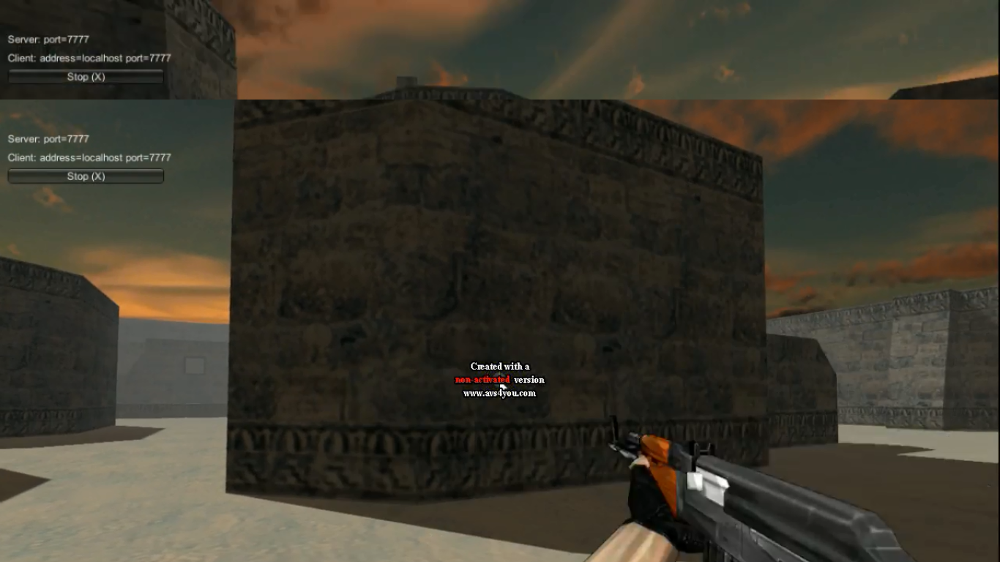
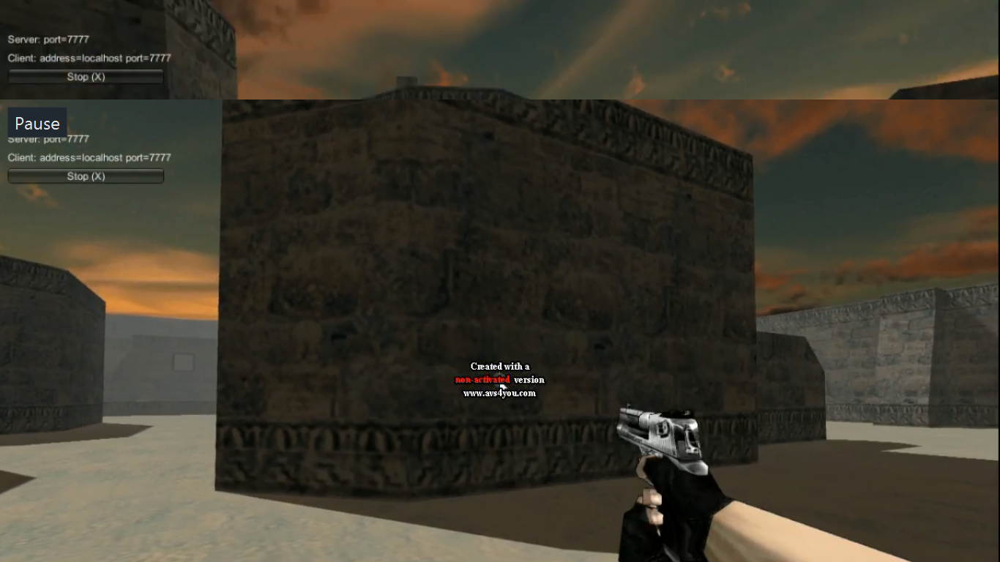
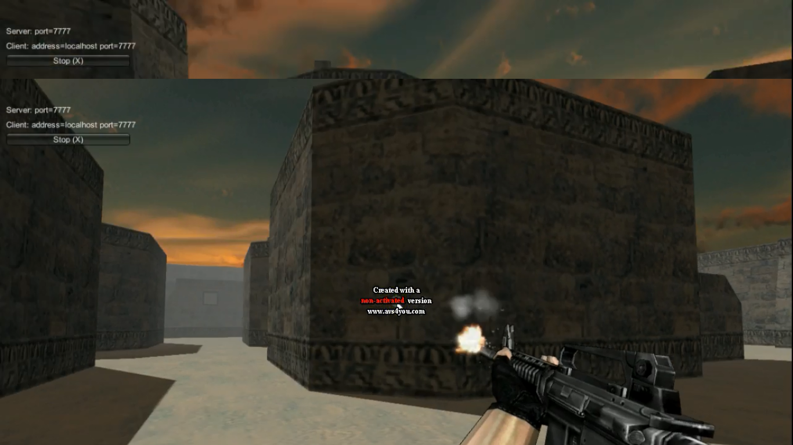
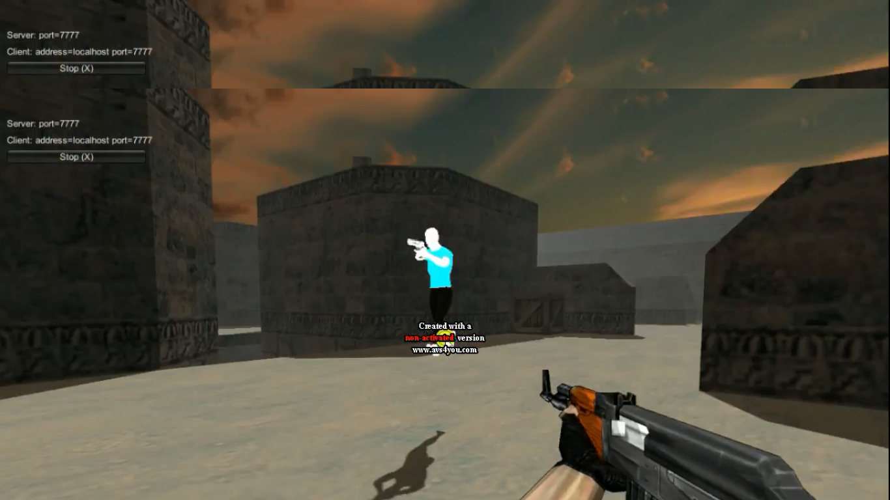
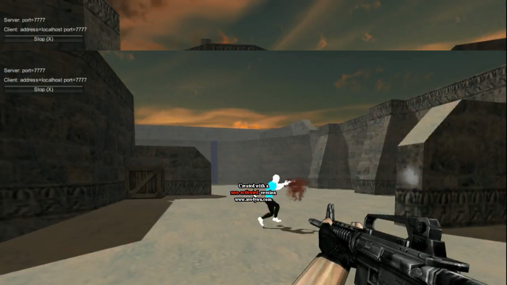

# Ashes

# Multiplayer FPS using Unity

This project involves the development of a multiplayer 3D First-Person Shooter (FPS) game using the Unity game engine and C#. The game is designed to be played from a first-person perspective, featuring realistic physics, dynamic lighting, and customizable characters and weapons. 

## Features:
- **3D Rendered Environment**: Detailed terrain, prefabs, and structures.
- **First-Person Perspective**: The game narrative is viewed from the player's viewpoint.
- **Real Physics Mechanics**: Realistic gravity, collision detection, and object movement using Nvidia’s PhysX.
- **Multiplayer Support**: Players can connect to a host and compete in real-time.
- **Character & Weapon Customization**: Players can personalize their avatars and weapons.
  
## Technologies Used:
- **Unity**: Game engine for asset development and rendering.
- **C#**: Programming language for game logic and interaction.
- **Visual Studio**: Coding IDE.
- **Blender/iClone**: 3D modeling and character design tools.

## Future Scope:
- Integration of VR support for a more immersive experience.
- Expansion of game maps and additional customization options for players and weapons. 

## Gameplay Images:

